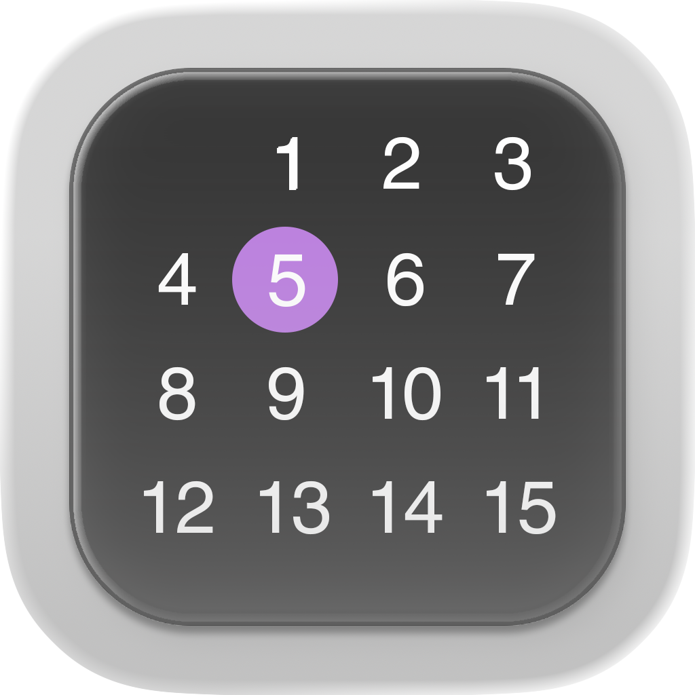

# ShiftLens

## **Shift Calendar — Built for the Heroes of Every Schedule**

Shift work isn’t just a job. It’s a lifestyle.  
Whether you’re a doctor saving lives at 3 AM, a nurse powering through a double shift, a firefighter on call, a retail worker keeping the city moving, or a technician making sure everything runs smoothly — **your time matters**.

**Shift Calendar** is designed for you.  
For the professionals who work when others sleep.  
For the teams who keep the world turning 24/7.  
For everyone whose schedule doesn’t fit inside a simple 9‑to‑5 box.

### **Why you’ll love it**
- **Crystal‑clear shift planning** that adapts to your real life  
- **Fast, intuitive tools** to add, edit, and visualize your workdays  
- **Smart reminders and clean overviews** so you never miss a beat  
- **Perfect for rotating shifts, night shifts, split shifts, on‑call duty, and everything in between**

### **Made for every profession**
Doctors, nurses, EMTs, police officers, hospitality staff, factory workers, airport crews, IT teams, freelancers — if your schedule is unique, **this app was built with you in mind**.

### **Own your time. Master your routine.**
Shift Calendar gives you clarity, control, and confidence over your work-life rhythm.  
Because your schedule shouldn’t be chaos — it should be **power**.

---
